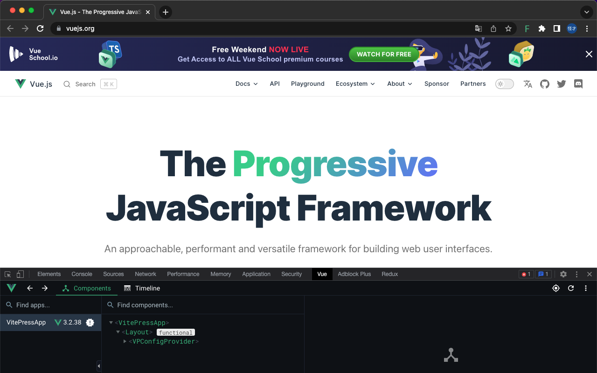

# Vue force dev

[TOC]

A tool forces Vue to run in development.

Easy to debug online Vue code.

## Install

[Chrome](https://chrome.google.com/webstore/detail/oohfffedbkbjnbpbbedapppafmlnccmb/reviews)

[Firefox](https://addons.mozilla.org/en-US/firefox/addon/vue-force-dev/)

## Screenshot




## FAQ

### How to update Pinia

1. Open this website: https://cdn.jsdelivr.net/npm/pinia/dist/pinia.mjs

2. Copy it's content to `src/plugins/vendors/pinia.js`

3. Modify the code as follows

```diff
- function devtoolsPlugin({ app, store, options }) {
+ export function devtoolsPlugin({ app, store, options }) {
```

```diff
- function registerPiniaDevtools(app, pinia) {
+ export function registerPiniaDevtools(app, pinia) {
```


